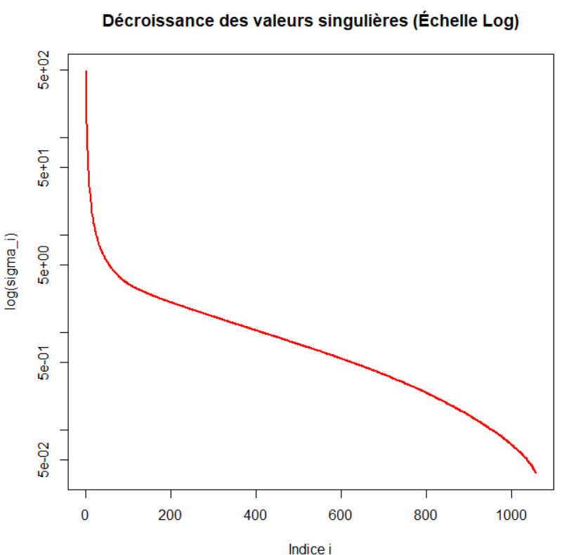

# TP1: 

## Exercice 1:
### Initialement l'image est en 3 dimensions: la largeur, la longeur et la dimension pour chaque couleur rouge bleue et verte
### J'ai donc "applati" l'image en séparant les composantes de chaque couleurs dans 3 variables différentes: img_r,img_g,img_b
### J'ai ensuite effectué la decomposition SVD de ces 3 matrices séparemment et en ai extrait les valeurs singulières
### En tracant l'histogramme des valeurs singulières on se rend compte que seules les premieres valeurs comportent la majorité de l'information tandis que les dernières portent essentiellement du bruit et de l'information redondante. 

### Cela vient du fait que la couleurs des pixels de la joconde ne sont pas totalement indépendant les uns des autres, les pixels ont très souvent une couleur proche de celle des pixels voisins ce qui fait que les premières valeurs singulière et les premiers vecteur u1 et v1 captent la structure et la forme globale du tableau tandis que les vecteurs suivant contiennent des informations plus détaillées. 
### J'ai ensuite choisi une variable k puis j'ai tronquée chaque matrice en ne gardant que les k premières.
### Si on note H la hauteur (nombre de ligne) et W la largeur (nombre de colonne) de l'image de base, alors U_tronquée sera de dimension H.k, la matrices des valeurs singulières sera de dimension k.k et transposée(V_tronquée) k.W
### J'ai ensuite recomposé chaque couleur en effectuant le produit matricielle USV^t puis rassembler les 3 couleurs dans une array puis pour chaque nouveau pixel qui etaient supérieurs à 1 ou inférieur 0 les ai remis à la bonne valeur pour que l'image puisse s'afficher correctement.
